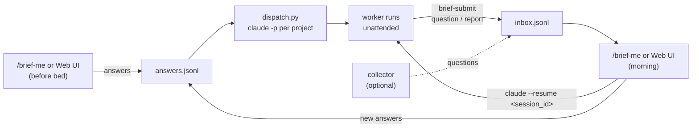

<div align="center">

# agent-brief-me

*An async decision inbox for Claude Code agents*

[](https://code.claude.com/docs/en/plugins)
[](https://www.python.org)
[](docs/schema.md)

[Features](#features) | [Install](#install) | [Daily loop](#daily-loop) | [Dispatch settings](#dispatch-settings) | [Extending](#extending)

[繁體中文](README.zh-TW.md)

</div>

Working agents that hit a decision only you can make, or that finish a piece of work, append a record to a shared inbox instead of blocking mid-run. You review the inbox in batches, answer in one sitting, and let follow-up sessions run unattended on your answers.

## Features

- **Non-blocking questions** - a worker files a question and keeps going (or finishes); nobody waits on a prompt overnight.
- **Batch review** - one `/brief-me` shows unread reports, then walks pending questions grouped by project, high severity first.
- **Dispatch on your answers** - each confirmed project gets a headless `claude -p` worker carrying exactly the answers it has not consumed yet.
- **Watch mode** - `/brief-me --watch` opens workers as visible interactive windows instead. The first time a project is opened this way Claude Code shows its one-time workspace trust dialog; accept it once per project.
- **Web UI** - `brief_me.py serve` gives the same inbox as a local page: zero tokens, click to answer, dismiss and restore questions, dispatch from the browser.
- **Resumable workers** - every record carries the worker's `session_id`; `claude --resume <id>` reopens that session to ask follow-ups.
- **Pluggable collector and notifier** - file questions from any source (feature lists, to-do files, webhooks) and get pinged on whatever your notifier script decides matters.
- **No database, no dependencies** - two append-only JSONL files and the Python standard library. State is derived by folding the files, so an interrupted run never loses anything.

## Install

agent-brief-me is a [skills-directory plugin](https://code.claude.com/docs/en/plugins): clone it into your personal skills directory and Claude Code loads it on the next session.

```sh
git clone https://github.com/RyanLeeYi/agent-brief-me.git ~/.claude/skills/agent-brief-me
```

Start (or restart) a Claude Code session and run:

```
/agent-brief-me:brief-init
```

It creates `~/.agent-brief/`, registers the projects to track, asks how workers should be launched (see [Dispatch settings](#dispatch-settings)), and runs a smoke test. Rerunning it is safe: existing files are never overwritten.

To update: `git -C ~/.claude/skills/agent-brief-me pull`. To verify the install: `claude plugin list` should show `agent-brief-me@skills-dir`.

> [!NOTE]
> Claude Code only, for now. A standalone MCP server so other agent runtimes can submit to the same inbox is future work.

## Daily loop

The only command you run day to day is `/brief-me` (short for `/agent-brief-me:brief-me`).



1. **Before bed** - run `/brief-me`. It shows what came in, walks you through pending questions, then offers to dispatch a follow-up worker for each project that has a fresh answer.
2. **Dispatch** - confirmed projects get a background `claude -p` session in their repo, prompt pre-loaded with your answers. Add `--watch` to open visible windows instead.
3. **Sleep** - workers run unattended. When blocked on something only you can decide they file a question; before finishing they file a report.
4. **In the morning** - run `/brief-me` again. Each report and question shows `resume: claude --resume <session_id>`; run it inside that project's directory to ask the worker directly.

> [!IMPORTANT]
> Overnight workers only keep running while the machine stays awake. Nothing here prevents sleep or hibernate.

### What lives in `~/.agent-brief/`

| File | Written by | Purpose |
|---|---|---|
| `config.json` | `brief-init` (or you, by hand) | tracked projects, collector/notify commands, dispatch settings |
| `inbox.jsonl` | collector, workers (`brief-submit`), `brief-me` (status lines) | questions, reports, and their `read` / `answered` / `cancelled` markers |
| `answers.jsonl` | `brief-me`, `dispatch.py` | your answers, each later re-appended with `consumed: true` once a worker received it |
| `logs/` | `dispatch.py` | stdout of each headless worker |

Nothing is ever rewritten in place. Current state is always re-derived by folding the files (see [`docs/schema.md`](docs/schema.md)).

### Skills

| Skill | Who runs it | What it does |
|---|---|---|
| `brief-init` | you, once | creates `~/.agent-brief/`, registers projects, sets dispatch options, smoke-tests |
| `brief-me` | you, daily | the review pass; file handling is in `scripts/brief_me.py` so the inbox never enters the model's context wholesale |
| `brief-submit` | workers | fire-and-forget write of a question or report; never waits for an answer |

## Web UI

A local page for the same inbox, for when you would rather click than chat - it costs no tokens because no model is involved:

```sh
python ~/.claude/skills/agent-brief-me/scripts/brief_me.py serve        # http://127.0.0.1:8765
python ~/.claude/skills/agent-brief-me/scripts/brief_me.py serve --port 9000
```

It binds to 127.0.0.1 by default (`--host 0.0.0.0` or a VPN address opts in to LAN/VPN access - the API has no authentication, so only on a network you trust), reads and appends the same two JSONL files as `/brief-me` (mix the two freely), and its Refresh button runs the configured collector. Each question offers its choices, a free-text "Other answer", and "Skip for now"; nothing is written until you press Save. What each decision writes:

| Decision | Written | Effect |
|---|---|---|
| A choice or Other answer | `answers.jsonl` + `answered` status | answer waits for the next dispatch |
| Skip for now | nothing | asked again next time |
| Dismiss question | `cancelled` status | gone from the inbox; the Dismissed page lists it with a Restore button, which writes `reopened` |
| Dispatch after save (checkbox) | - | after saving, runs `scripts/dispatch.py` for every project with unconsumed answers; `--watch` opens visible windows instead of headless sessions |

## Dispatch settings

`scripts/dispatch.py` reads the `dispatch` object in `~/.agent-brief/config.json` when launching workers:

```json
"dispatch": {
  "watch": false,
  "permission_mode": "auto",
  "allowed_tools": "Bash,Read,Edit,Write,Glob,Grep,Skill",
  "model": null,
  "delegate": true
}
```

| Key | Meaning |
|---|---|
| `watch` | `true` opens an interactive `claude` window per project instead of a headless `claude -p` (same as `--watch`) |
| `permission_mode` | `auto` (default; combined with `allowed_tools`, classifier-blocked actions are silently denied in headless mode) or `bypassPermissions` |
| `allowed_tools` | comma-separated `--allowedTools` value used with `auto` |
| `model` | `--model` for the worker; `null` keeps Claude Code's default |
| `delegate` | `false` tells workers to work solo and blocks the `Agent` tool - use it if your repos have no subagent-delegation rules |

`~/.agent-brief` is always passed via `--add-dir` so `brief-submit` can write the inbox from inside a project. Missing keys fall back to the defaults above; an unknown `permission_mode` falls back to `auto`.

> [!TIP]
> To change settings, edit `config.json` directly - it costs no tokens and applies on the next dispatch. Rerunning `brief-init` also works but spends a few thousand tokens on the walkthrough.

> [!WARNING]
> `bypassPermissions` launches workers with `--dangerously-skip-permissions`. Every command - recursive deletes, force pushes, anything - runs without confirmation, unattended, possibly overnight. The only safety left is whatever hooks and guards your repos configure themselves. Prefer `auto` with a tight `allowed_tools`.

## Extending

### Collector

`config.json`'s `collector` is an argv array. Every `/brief-me` run executes it (cwd `~/.agent-brief`) before reading the inbox, so it can pull to-dos from any source and file them as `question` or `report` records. A non-zero exit is shown as a warning; the review continues.

```json
{"projects": [], "collector": ["python3", "/path/to/todo-collector.py"], "notify": null}
```

A minimal collector that files each line of `~/todo.txt` as a low-severity question (reuse `atomic_append_line` from [`docs/schema.md`](docs/schema.md) verbatim):

```python
import os, uuid
from datetime import datetime, timezone

# atomic_append_line(path, record) -- see docs/schema.md

brief_home = os.path.expanduser("~/.agent-brief")
with open(os.path.expanduser("~/todo.txt")) as f:
    for line in f:
        text = line.strip()
        if not text:
            continue
        atomic_append_line(os.path.join(brief_home, "inbox.jsonl"), {
            "type": "question",
            "id": str(uuid.uuid4()),
            "project": "todo-import",
            "title": text,
            "body": "",
            "severity": "low",
            "created_at": datetime.now(timezone.utc).strftime("%Y-%m-%dT%H:%M:%SZ"),
        })
```

Any structured source works the same way - an issue tracker webhook, a calendar export, a cron job scraping logs - as long as it appends valid records through the same atomic-append rule.

A complete, real collector is in [`examples/feature-list-collector.py`](examples/feature-list-collector.py): it scans each tracked repo's `feature_list.json` and files sign-off questions for unapproved entries plus a nightly "run tonight?" proposal for approved ones. Its header documents the exact format it assumes; adapt `scan_project` if yours differs.

### Notifier

`config.json`'s `notify` is also an argv array (or `null`). Every submission (question or report, any severity) runs it once with four trailing arguments: `<project> <type> <severity> <text>` - `type` is `question` or `report`, `severity` is the record's severity (`normal` for a question without one, `none` for a report without one), `text` is the question title or the first line of the report summary. Your script decides what is worth a ping.

```json
{"projects": [], "collector": null, "notify": ["python3", "/path/to/send-telegram.py"]}
```

Your script receives e.g. `send-telegram.py my-project question high "prod deploy blocked: pick a rollback strategy"` or `send-telegram.py my-project report none "F12 passing; no blockers; session-handoff.md"`.

### Teaching other sessions to use the inbox

Workers spawned by `dispatch.py` get the protocol in their prompt: use `brief-submit` when blocked on a user decision, and once more before finishing to report. For sessions you start by other means (cron, your own scripts), `brief-init` offers to append that one-paragraph protocol to a rules file you name - your global instructions file is the usual target.

## Further reading

- [`docs/schema.md`](docs/schema.md) - authoritative inbox schema and the atomic-append protocol.
- [`docs/headless-delegation-evidence.md`](docs/headless-delegation-evidence.md) - evidence that headless workers can themselves delegate to subagents.
- [`AGENTS.md`](AGENTS.md) - development conventions for this repo.
