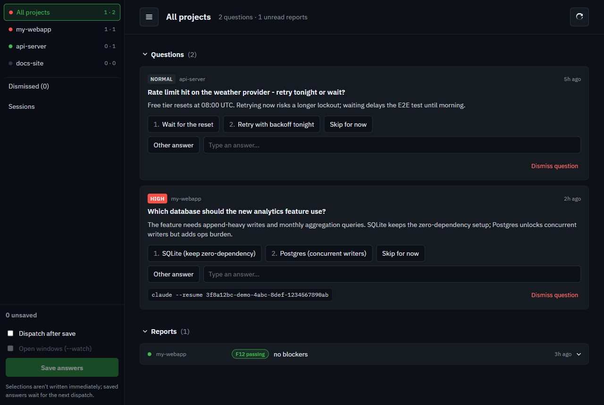
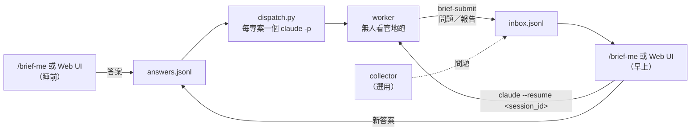

<div align="center">

# agent-brief-me

*給 Claude Code agent 用的非同步決策收件匣*

[](https://code.claude.com/docs/en/plugins)
[](https://www.python.org)
[](docs/schema.md)

[特色](#特色) | [安裝](#安裝) | [每日流程](#每日流程) | [派工設定](#派工設定) | [擴充](#擴充)

[English](README.md)

</div>

工作中的 agent 碰到只有你能做的決定、或做完一段工作時，把紀錄寫進共用收件匣就繼續跑，不會卡在提示上等你。你一次把收件匣看完、答完，再讓後續 session 帶著你的答案無人看管地跑下去。



## 特色

- **不阻塞的提問** - worker 投一筆問題就繼續做（或收工），沒有人整晚掛在提示上等。
- **批次審閱** - 一個 `/brief-me` 先列未讀報告，再依專案分組、高嚴重度優先逐題走完待答問題。
- **照你的答案派工** - 每個你確認的專案開一個 headless `claude -p` worker，只帶它尚未消費的答案。
- **觀察模式** - `/brief-me --watch` 改成開可見的互動視窗，讓你盯著看。某個專案第一次這樣開時，Claude Code 會跳一次性的資料夾信任對話框，每個專案按一次即可。
- **Web UI** - `brief_me.py serve` 把同一個收件匣變成本機網頁：零 token、點選作答、丟棄與還原問題、直接從瀏覽器派工。
- **可接續的 worker** - 每筆紀錄都帶 worker 的 `session_id`，`claude --resume <id>` 就能回到那個 session 追問。Web UI 上這串指令是按鈕，點一下就複製。
- **手機友善** - Web UI 單手可用：抽屜式側欄、堆疊卡片、44px 觸控目標。躺在床上就能批完收件匣。
- **可插拔的 collector 與通知** - 從任何來源（feature list、待辦檔、webhook）投問題，高嚴重度時通知你。
- **沒有資料庫、沒有依賴** - 兩個只追加的 JSONL 檔加 Python 標準函式庫。狀態靠折疊檔案推導，中途斷掉不會丟任何東西。

## 安裝

agent-brief-me 是一個 [skills-directory plugin](https://code.claude.com/docs/en/plugins)：clone 進個人 skills 目錄，下一個 session Claude Code 就會載入。

```sh
git clone https://github.com/RyanLeeYi/agent-brief-me.git ~/.claude/skills/agent-brief-me
```

開（或重開）一個 Claude Code session，執行：

```
/agent-brief-me:brief-init
```

它會建立 `~/.agent-brief/`、登記要追蹤的專案、問你 worker 要怎麼開（見[派工設定](#派工設定)），最後跑一次 smoke test。重跑是安全的：既有檔案不會被覆寫。

更新：`git -C ~/.claude/skills/agent-brief-me pull`。確認安裝：`claude plugin list` 應列出 `agent-brief-me@skills-dir`。

> [!NOTE]
> 目前只支援 Claude Code。讓其他 agent runtime 也能投進同一個收件匣的獨立 MCP server 是之後的事。

## 每日流程

日常只需要一個指令：`/brief-me`（`/agent-brief-me:brief-me` 的簡稱）。



1. **睡前** - 跑 `/brief-me`。先看進來的東西，逐題回答，然後對每個有新答案的專案問你要不要派後續 worker。
2. **派工** - 確認的專案各開一個背景 `claude -p` session 在它的 repo 裡，prompt 已塞好你的答案。加 `--watch` 改開可見視窗。
3. **睡覺** - worker 無人看管地跑。碰到只有你能決定的事就投問題；收工前投一份報告。
4. **早上** - 再跑一次 `/brief-me`。每筆報告與問題都顯示 `resume: claude --resume <session_id>`，到該專案目錄下執行就能直接問那個 worker。

> [!IMPORTANT]
> 過夜的 worker 只在機器醒著時才會繼續跑。這裡沒有任何東西會阻止休眠。

### `~/.agent-brief/` 裡有什麼

| 檔案 | 誰寫 | 用途 |
|---|---|---|
| `config.json` | `brief-init`（或你手動） | 追蹤的專案、collector／notify 指令、派工設定 |
| `inbox.jsonl` | collector、worker（`brief-submit`）、`brief-me`（狀態行） | 問題、報告，以及它們的 `read`／`answered`／`cancelled` 標記 |
| `answers.jsonl` | `brief-me`、`dispatch.py` | 你的答案；worker 收到後會再追加一筆 `consumed: true` |
| `logs/` | `dispatch.py` | 每個 headless worker 的 stdout |

沒有任何東西會被原地改寫。目前狀態永遠靠折疊檔案重新推導（見 [`docs/schema.md`](docs/schema.md)）。

### Skills

| Skill | 誰跑 | 做什麼 |
|---|---|---|
| `brief-init` | 你，一次 | 建 `~/.agent-brief/`、登記專案、設派工選項、smoke test |
| `brief-me` | 你，每天 | 審閱流程；檔案處理在 `scripts/brief_me.py`，收件匣不會整份進模型 context |
| `brief-submit` | worker | 投一筆問題或報告就走，從不等答案 |

## Web UI

同一個收件匣的本機網頁版，想用點的不想用聊的就開它——沒有模型參與，所以零 token：

```sh
python ~/.claude/skills/agent-brief-me/scripts/brief_me.py serve        # http://127.0.0.1:8765
python ~/.claude/skills/agent-brief-me/scripts/brief_me.py serve --port 9000
```

預設只綁 127.0.0.1（`--host 0.0.0.0` 或 VPN 位址可開放給區網／VPN——API 沒有驗證，只能在你完全信任的網段用），讀寫的是與 `/brief-me` 相同的兩個 JSONL 檔（兩者可混用），Refresh 鈕會跑設定的 collector。每題提供選項、自由填寫的「Other answer」與「Skip for now」；按 Save 之前什麼都不會寫入。

Report 收合成一列（專案、`F12 passing` 這類 feature 晶片、摘要首行），展開後分 **Done / Blocked / Handoff** 三段。展開不會自動標已讀，要按 **Mark read** 才算。兩種卡片上的 `claude --resume <session_id>` 都是按鈕：點一下複製指令，到該專案目錄貼上就能重開那個 worker。

各種處置寫什麼：

| 處置 | 寫入 | 效果 |
|---|---|---|
| 選項或 Other answer | `answers.jsonl` ＋ `answered` 狀態 | 答案等待下一次派工 |
| Skip for now | 不寫 | 下次再問 |
| Dismiss question | `cancelled` 狀態 | 從收件匣消失；Dismissed 頁列出並提供 Restore，按下寫 `reopened` |
| Dispatch after save（勾選） | - | 儲存後對所有有未消費答案的專案執行 `scripts/dispatch.py`；`--watch` 改開可見視窗而非 headless session |

### Sessions 檢視

側欄的 **Sessions** 顯示派工之後發生了什麼：

- **Running** - 每個進行中的 worker：專案、派給它的任務、經過時間。
- **Finished** - 歷史 worker 的表格：結果徽章（`report` / `killed` / `ctrl-c`）、任務、耗時，以及同一顆點擊複製的 `claude --resume` 按鈕，可重開任何一場。

## 派工設定

`scripts/dispatch.py` 開 worker 時讀 `~/.agent-brief/config.json` 的 `dispatch` 區塊：

```json
"dispatch": {
  "watch": false,
  "permission_mode": "auto",
  "allowed_tools": "Bash,Read,Edit,Write,Glob,Grep,Skill",
  "model": null,
  "delegate": true,
  "context_model": "sonnet",
  "context_language": null,
  "plain_language": "off"
}
```

| 鍵 | 意義 |
|---|---|
| `watch` | `true` 每個專案開一個互動 `claude` 視窗，取代 headless `claude -p`（等同 `--watch`） |
| `permission_mode` | `auto`（預設；搭配 `allowed_tools`，被分類器擋的動作在 headless 下會被靜默拒絕）或 `bypassPermissions` |
| `allowed_tools` | `auto` 模式下的 `--allowedTools`，逗號分隔 |
| `model` | worker 的 `--model`；`null` 用 Claude Code 預設 |
| `delegate` | `false` 要 worker 自己做、並封鎖 `Agent` 工具 - repo 還沒有 subagent 委派規則時用這個 |
| `context_model` | 補脈絡 session（收件匣的「Add context」動作／`dispatch.py --refill`）用的 `--model`；缺鍵或 null 預設 `"sonnet"`，與上面的 `model` 各自獨立 - `--resume` 沒有快取、全價計算，建議選便宜的模型 |
| `context_language` | 自由格式的語言描述（例如 `"Traditional Chinese (keep technical terms in English)"`），加進補脈絡 session 的 prompt，要求其重投卡的 title／body 用該語言撰寫；`null`（預設）不改變該 prompt |
| `plain_language` | `"off"`（預設，不改變）、`"refill"`（補脈絡重投卡須用白話、非技術語言）、或 `"all"`（同一要求也套用到一般 worker 透過 `brief-submit` 投遞的每個 question／report，且在 `context_language` 有值時一併要求該語言） |

`~/.agent-brief` 一律透過 `--add-dir` 帶入，讓 `brief-submit` 能從專案內寫收件匣。缺鍵用上面的預設值；`permission_mode` 值不認得時退回 `auto`。

> [!TIP]
> 要改設定直接編輯 `config.json` - 零 token，下次派工生效。重跑 `brief-init` 也可以，但整套問答會花幾千 token。

> [!WARNING]
> `bypassPermissions` 會用 `--dangerously-skip-permissions` 開 worker。任何指令 - 遞迴刪除、force push、什麼都一樣 - 不經確認就執行，無人看管，可能整晚。剩下的唯一防線是各 repo 自己設的 hook 與 guard。建議用 `auto` 加上收緊的 `allowed_tools`。

## 擴充

### Collector

`config.json` 的 `collector` 是 argv 陣列。每次 `/brief-me` 在讀收件匣前先執行它（cwd `~/.agent-brief`），所以它可以從任何來源抓待辦，寫成 `question` 或 `report` 紀錄。非零結束碼只顯示警告，審閱照常進行。

```json
{"projects": [], "collector": ["python3", "/path/to/todo-collector.py"], "notify": null}
```

最小範例：把 `~/todo.txt` 每一行投成低嚴重度問題（`atomic_append_line` 請原樣取自 [`docs/schema.md`](docs/schema.md)）：

```python
import os, uuid
from datetime import datetime, timezone

# atomic_append_line(path, record) -- 見 docs/schema.md

brief_home = os.path.expanduser("~/.agent-brief")
with open(os.path.expanduser("~/todo.txt")) as f:
    for line in f:
        text = line.strip()
        if not text:
            continue
        atomic_append_line(os.path.join(brief_home, "inbox.jsonl"), {
            "type": "question",
            "id": str(uuid.uuid4()),
            "project": "todo-import",
            "title": text,
            "body": "",
            "severity": "low",
            "created_at": datetime.now(timezone.utc).strftime("%Y-%m-%dT%H:%M:%SZ"),
        })
```

任何結構化來源都一樣 - issue tracker webhook、行事曆匯出、掃 log 的 cron - 只要照同一條 atomic-append 規則追加合法紀錄。

完整可用的真實 collector 在 [`examples/feature-list-collector.py`](examples/feature-list-collector.py)：掃每個追蹤 repo 的 `feature_list.json`，對未簽核條目投簽核問題、對已簽核條目投每晚的「run tonight?」提案。檔頭寫明它假設的格式；格式不同就改 `scan_project`。

### 通知

`config.json` 的 `notify` 也是 argv 陣列（或 `null`）。每一筆投遞（question 或 report、任何嚴重度）都執行一次，尾端追加四個參數：`<project> <type> <severity> <text>`——`type` 是 `question` 或 `report`，`severity` 是該記錄的嚴重度（question 未填為 `normal`、report 未填為 `none`），`text` 是問題標題或報告摘要首行。要不要推播由你的腳本決定。

```json
{"projects": [], "collector": null, "notify": ["python3", "/path/to/send-telegram.py"]}
```

你的腳本會收到像 `send-telegram.py my-project question high "prod deploy blocked: pick a rollback strategy"` 或 `send-telegram.py my-project report none "F12 passing; no blockers; session-handoff.md"` 這樣的呼叫。

`dispatch.py` 在整批 worker 都結束時也會呼叫一次，`type` 為 `batch`：`send-telegram.py my-project,other-project batch none "2/2 sessions finished"`。等待由獨立的背景行程負責，dispatch 本身仍立即返回。

### 讓其他 session 也用收件匣

`dispatch.py` 開的 worker 在 prompt 裡就帶了協定：卡在使用者決策時用 `brief-submit`，收工前再用一次投報告。其他方式開的 session（cron、自己的腳本）則由 `brief-init` 提議把那一段協定追加到你指定的規則檔 - 通常是全域指令檔。

Question 的 body 必須自足 - 審核者在手機上讀，沒有 repo 也沒有 worker 的對話脈絡。範本定義在 `brief-submit`（`Context:`／`Options:` 每個選項一句後果／`Recommendation:` 附理由）。

## 延伸閱讀

- [`docs/schema.md`](docs/schema.md) - 收件匣 schema 與 atomic-append 協定的權威來源。
- [`docs/headless-delegation-evidence.md`](docs/headless-delegation-evidence.md) - headless worker 自己也能委派 subagent 的證據。
- [`AGENTS.md`](AGENTS.md) - 本 repo 的開發慣例。
